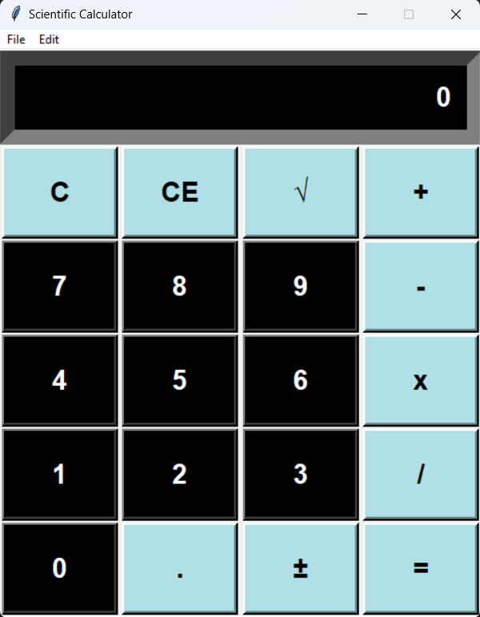

# Scientific Calculator

A comprehensive and user-friendly scientific calculator built using Python's `tkinter` library. 

## Details

The application is developed in Python, leveraging the power of the following modules:
- `tkinter` - for creating the graphical user interface.
- `math` - to provide various mathematical functions.

### Features

- **Two Modes**: Users can switch between 'Standard' and 'Scientific' modes based on their needs.
- **Rich Functionality**: Along with basic arithmetic, the calculator provides trigonometric, logarithmic, and other advanced mathematical functions.
- **Interactive Interface**: The application boasts a user-friendly interface with responsive buttons and a clear display.

## Getting Started

1. Ensure you have Python installed on your machine.
2. Install `tkinter` if it isn't already present.
3. Clone the repository: `git clone <repository_url>`
4. Navigate to the directory and run the script: `python calculator_script_name.py`

## How to Use

- Launch the application.
- For basic arithmetic, use the number buttons and basic operation keys.
- Switch to the 'Scientific' mode for advanced mathematical operations.
- Utilize the menu bar for options like switching between modes and exiting the application.

## Screenshots

## Contributions

Contributions, bug reports, and fixes are welcome. Please open an issue if you find a bug or have a feature request.

## License

This project is licensed under the MIT License - see the [LICENSE.md](LICENSE.md) file for details.

## Acknowledgement

Special thanks to the Python and `tkinter` community for resources and support.

